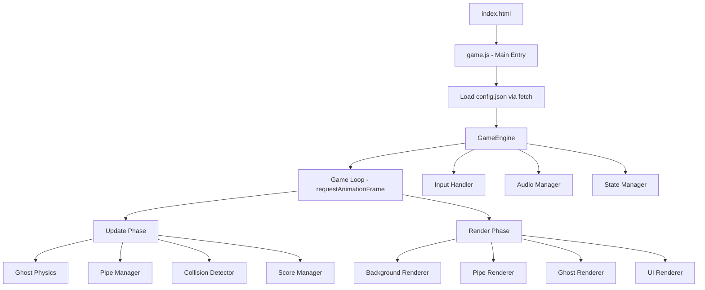
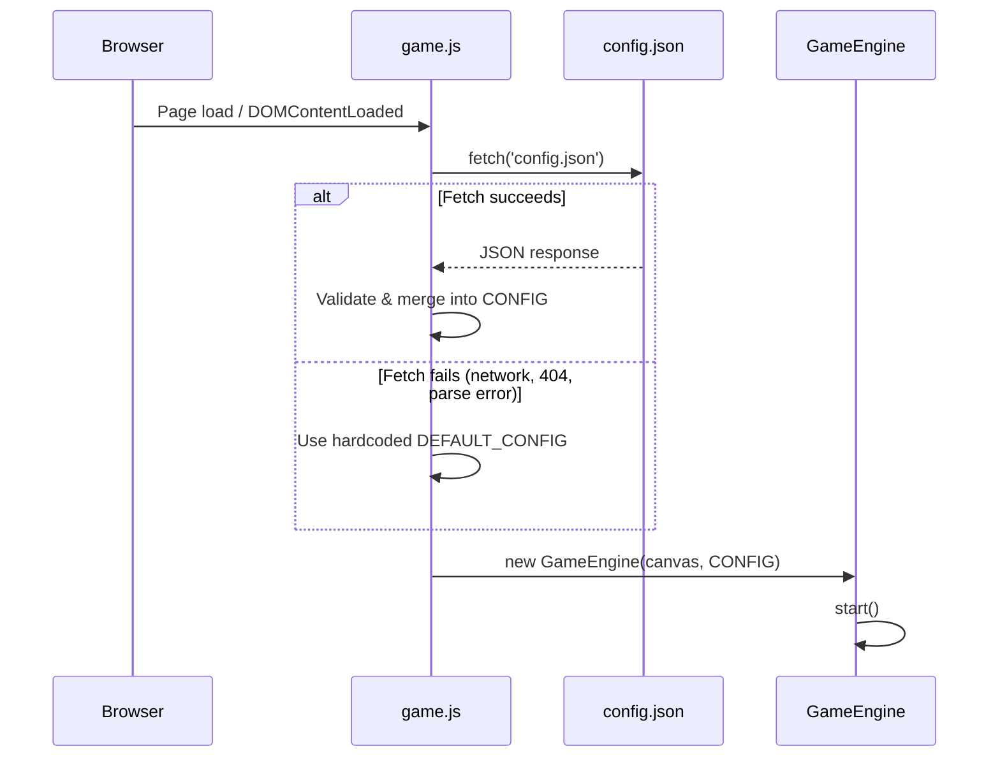
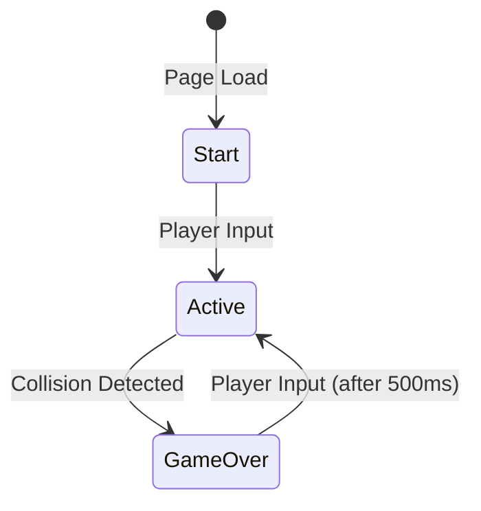

# Design Document: Flappy Ghosty

## Overview

Flappy Ghosty is a client-side infinite runner game built with HTML5 Canvas and vanilla JavaScript. The game renders a ghost sprite that the player controls via keyboard/mouse input to navigate through scrolling pipe obstacles. The architecture follows a classic game loop pattern with discrete game states (start, active, game over), frame-based rendering, and delta-time physics to ensure consistent behavior across varying frame rates.

The game runs entirely in the browser with no build tools, frameworks, or server dependencies. It consists of a single HTML file loading a JavaScript module that manages game state, physics, rendering, collision detection, audio, and scoring.

All tunable game parameters (gravity, pipe speed, gap size, jump velocity, timing thresholds, etc.) are externalized into a `config.json` file at the project root. The GameEngine fetches this file on startup and populates the runtime CONFIG object. If the fetch fails (network error, malformed JSON, missing file), hardcoded default values are used as a fallback, ensuring the game remains playable without a valid config file.

### Project Structure

```
project-root/
├── index.html          # Entry point, canvas element, loads game.js
├── config.json         # External game configuration (tunable parameters)
├── game.js             # Main game module (all game logic)
└── assets/
    ├── ghosty.png      # Ghost sprite
    ├── jump.wav        # Jump sound effect
    └── game_over.wav   # Game over sound effect
```

## Architecture

The game follows a component-based architecture organized around a central game loop. Each component has a single responsibility and communicates through shared game state.



### Configuration Loading Flow



### Game States



The game operates in three distinct states:
1. **Start** — Ghost displayed stationary, no physics, no pipes, waiting for input
2. **Active** — Full game loop running: physics, pipe generation, collision checks, scoring
3. **GameOver** — Everything frozen, overlay shown, waiting for restart input after 500ms cooldown

## Components and Interfaces

### GameEngine

The central orchestrator that owns the game loop and coordinates all components.

```javascript
class GameEngine {
  constructor(canvas, config)     // Initialize with canvas and loaded CONFIG object
  static async loadConfig()      // Fetch config.json, return merged config or defaults
  start()                        // Initialize and show start screen
  update(deltaTime)              // Advance game state by deltaTime seconds
  render()                       // Draw current frame
  transition(newState)           // Change game state (start | active | gameOver)
  reset()                        // Reset all components to initial state
}
```

### ConfigLoader

Responsible for fetching and validating the external configuration file.

```javascript
class ConfigLoader {
  static async load(url = 'config.json')   // Fetch and parse config.json
  static validate(json)                     // Validate required fields and value ranges
  static merge(loaded, defaults)            // Deep merge loaded values over defaults
}
```

### Ghost

Manages the player character's position, velocity, and visual rotation.

```javascript
class Ghost {
  constructor(spriteImage, playArea)
  x, y                       // Position (top-left of bounding box)
  width, height              // Sprite dimensions
  velocityY                  // Current vertical velocity (pixels/second)
  rotation                   // Current rotation angle (radians)

  applyGravity(deltaTime)    // Apply gravitational acceleration
  jump()                     // Set velocity to upward impulse value
  updatePosition(deltaTime)  // Update Y based on velocity * deltaTime
  updateRotation()           // Interpolate rotation from velocity
  getBoundingBox()           // Return {x, y, width, height} for collision
  reset(playArea)            // Reposition to starting location
}
```

### PipeManager

Handles generation, movement, and cleanup of pipe pairs.

```javascript
class PipeManager {
  constructor(playArea, gapHeight)
  pipes                      // Array of active PipePair objects

  update(deltaTime)          // Move pipes, generate new, remove offscreen
  reset()                    // Clear all pipes
  getCollidables()           // Return array of bounding boxes for all pipe segments
}

class PipePair {
  constructor(x, gapCenterY, gapHeight, pipeWidth, playArea)
  x                          // Current horizontal position
  topPipeHeight              // Height of the top pipe
  bottomPipeY                // Y position where bottom pipe starts
  scored                     // Whether this pair has been scored

  getTopBoundingBox()        // Bounding box including cap
  getBottomBoundingBox()     // Bounding box including cap
  getTrailingEdgeX()         // Right edge X for scoring check
}
```

### CollisionDetector

Performs axis-aligned bounding box (AABB) overlap detection.

```javascript
class CollisionDetector {
  checkCollision(ghostBox, pipeBoxes, playArea)  // Returns boolean
  static aabbOverlap(boxA, boxB)                 // Static AABB test
}
```

### ScoreManager

Tracks current score, high score, and handles localStorage persistence.

```javascript
class ScoreManager {
  constructor()
  score                      // Current score
  highScore                  // Loaded from localStorage

  increment()                // Increase score by 1, update high if needed
  reset()                    // Set score to 0, retain high score
  persist()                  // Save high score to localStorage
  loadHighScore()            // Read high score from localStorage
}
```

### AudioManager

Handles loading and playback of sound effects.

```javascript
class AudioManager {
  constructor()
  playJump()                 // Play jump.wav
  playGameOver()             // Play game_over.wav
}
```

### InputHandler

Captures and normalizes player input events, filtering held-key repeats.

```javascript
class InputHandler {
  constructor(canvas)
  onJump(callback)           // Register jump callback
  enable()                   // Start listening for input
  disable()                  // Stop listening
}
```

### BackgroundRenderer

Renders the sky, pencil texture, and parallax clouds.

```javascript
class BackgroundRenderer {
  constructor(playArea)
  clouds                     // Array of cloud objects with position, size, speed, opacity

  update(deltaTime)          // Move clouds left, wrap around
  render(ctx)                // Draw sky, texture, clouds
}
```

## Data Models

### External Configuration File (`config.json`)

The `config.json` file lives at the project root alongside `index.html` and contains all tunable game parameters. This file is fetched by the game on startup.

```json
{
  "canvas": {
    "width": 400,
    "height": 600
  },
  "scoreBar": {
    "height": 40
  },
  "ghost": {
    "startXFraction": 0.25,
    "gravity": 980,
    "maxFallSpeed": 500,
    "jumpVelocity": -300,
    "maxRotationUp": -30,
    "maxRotationDown": 30
  },
  "pipes": {
    "width": 50,
    "capWidth": 60,
    "capHeight": 20,
    "horizontalSpacing": 220,
    "speed": 150,
    "minPipeLength": 50,
    "gapMultiplierMin": 3,
    "gapMultiplierMax": 4
  },
  "clouds": {
    "count": 5,
    "minSpeedFraction": 0.10,
    "maxSpeedFraction": 0.50,
    "minOpacity": 0.3,
    "maxOpacity": 0.7
  },
  "timing": {
    "maxDeltaTime": 0.25,
    "gameOverCooldown": 500
  }
}
```

#### Config JSON Schema Constraints

| Section | Field | Type | Valid Range | Description |
| ------- | ----- | ---- | ----------- | ----------- |
| canvas | width | integer | > 0 | Canvas pixel width |
| canvas | height | integer | > 0 | Canvas pixel height |
| scoreBar | height | integer | 30–50 | Score bar pixel height |
| ghost | startXFraction | float | 0.0–1.0 | Horizontal start as fraction of canvas width |
| ghost | gravity | float | 800–1200 | Downward acceleration (px/s²) |
| ghost | maxFallSpeed | float | 400–600 | Terminal velocity cap (px/s) |
| ghost | jumpVelocity | float | -350 to -250 | Upward impulse on jump (px/s) |
| ghost | maxRotationUp | float | -45 to 0 | Max nose-up rotation (degrees) |
| ghost | maxRotationDown | float | 0 to 45 | Max nose-down rotation (degrees) |
| pipes | width | integer | 40–60 | Pipe body width (px) |
| pipes | capWidth | integer | > pipes.width | Pipe cap width (px) |
| pipes | capHeight | integer | > 0 | Pipe cap height (px) |
| pipes | horizontalSpacing | integer | 200–250 | Distance between pipe pairs (px) |
| pipes | speed | float | 100–200 | Horizontal scroll speed (px/s) |
| pipes | minPipeLength | integer | > 0 | Minimum visible pipe length (px) |
| pipes | gapMultiplierMin | float | >= 2 | Minimum gap as multiple of ghost height |
| pipes | gapMultiplierMax | float | > gapMultiplierMin | Maximum gap as multiple of ghost height |
| clouds | count | integer | >= 3 | Number of background clouds |
| clouds | minSpeedFraction | float | 0.0–1.0 | Min cloud speed as fraction of pipe speed |
| clouds | maxSpeedFraction | float | > minSpeedFraction, <= 1.0 | Max cloud speed fraction |
| clouds | minOpacity | float | 0.0–1.0 | Minimum cloud opacity |
| clouds | maxOpacity | float | > minOpacity, <= 1.0 | Maximum cloud opacity |
| timing | maxDeltaTime | float | > 0 | Delta-time clamp in seconds |
| timing | gameOverCooldown | integer | > 0 | Restart input cooldown in milliseconds |

### Runtime CONFIG Object (populated from config.json)

The runtime CONFIG object is populated by merging the loaded `config.json` values over hardcoded defaults. If `config.json` is unavailable or contains invalid data, the defaults below are used in full.

```javascript
// Hardcoded defaults — used as fallback if config.json cannot be loaded
const DEFAULT_CONFIG = {
  canvas: { width: 400, height: 600 },
  scoreBar: { height: 40 },
  ghost: {
    startXFraction: 0.25,
    gravity: 980,
    maxFallSpeed: 500,
    jumpVelocity: -300,
    maxRotationUp: -30,
    maxRotationDown: 30,
  },
  pipes: {
    width: 50,
    capWidth: 60,
    capHeight: 20,
    horizontalSpacing: 220,
    speed: 150,
    minPipeLength: 50,
    gapMultiplierMin: 3,
    gapMultiplierMax: 4,
  },
  clouds: {
    count: 5,
    minSpeedFraction: 0.10,
    maxSpeedFraction: 0.50,
    minOpacity: 0.3,
    maxOpacity: 0.7,
  },
  timing: {
    maxDeltaTime: 0.25,
    gameOverCooldown: 500,
  },
};

// At runtime, CONFIG is the result of merging loaded JSON over defaults:
// const CONFIG = ConfigLoader.merge(loadedJson, DEFAULT_CONFIG);
```

### Config Loading Logic

```javascript
async function initGame() {
  let config;
  try {
    const response = await fetch('config.json');
    if (!response.ok) throw new Error(`HTTP ${response.status}`);
    const json = await response.json();
    config = ConfigLoader.merge(json, DEFAULT_CONFIG);
    console.log('Game config loaded from config.json');
  } catch (error) {
    console.warn('Failed to load config.json, using defaults:', error.message);
    config = { ...DEFAULT_CONFIG };
  }
  const canvas = document.getElementById('gameCanvas');
  const engine = new GameEngine(canvas, config);
  engine.start();
}
```

### Game State Object

```javascript
const gameState = {
  current: 'start',              // 'start' | 'active' | 'gameOver'
  gameOverTimestamp: null,        // Used for 500ms input cooldown
}
```

### Cloud Data Structure

```javascript
{
  x: Number,          // horizontal position
  y: Number,          // vertical position
  width: Number,      // cloud width (proportional to speed)
  height: Number,     // cloud height
  speed: Number,      // pixels/second (fraction of pipe speed)
  opacity: Number,    // 0.3 to 0.7 (proportional to speed)
}
```

### LocalStorage Schema

```javascript
// Key: 'flappyGhosty_highScore'
// Value: JSON number (integer)
localStorage.getItem('flappyGhosty_highScore')  // Returns string or null
localStorage.setItem('flappyGhosty_highScore', JSON.stringify(score))
```


## Correctness Properties

*A property is a characteristic or behavior that should hold true across all valid executions of a system — essentially, a formal statement about what the system should do. Properties serve as the bridge between human-readable specifications and machine-verifiable correctness guarantees.*

### Property 1: Cloud generation invariants

*For any* random seed used to generate clouds, the resulting cloud array SHALL contain at least 3 clouds, each with an opacity value between 0.3 and 0.7 inclusive, at varying vertical positions within the play area.

**Validates: Requirements 1.2**

### Property 2: Jump overrides velocity

*For any* ghost with any current vertical velocity (positive, negative, or zero), applying a jump SHALL set the vertical velocity to exactly the fixed jump impulse value (between -250 and -350 px/s), regardless of the previous velocity magnitude.

**Validates: Requirements 2.1, 3.3**

### Property 3: Input repeat filtering

*For any* sequence of keyboard events where the `event.repeat` flag is true, the input handler SHALL NOT trigger a jump callback. Only events where `event.repeat` is false SHALL trigger jumps.

**Validates: Requirements 2.5**

### Property 4: Gravity application with velocity cap

*For any* ghost in the active state with any current velocity and any positive delta time, applying gravity SHALL increase the velocity by gravity * deltaTime, but the resulting velocity SHALL never exceed the maximum fall speed cap (between 400 and 600 px/s).

**Validates: Requirements 3.1, 3.2**

### Property 5: Ghost position update

*For any* ghost with position Y and velocity V, and any positive delta time dt, the updated position SHALL equal Y + V * dt (before collision checks).

**Validates: Requirements 3.4**

### Property 6: No physics in non-active states

*For any* game state that is 'start' or 'gameOver', and any positive delta time, running an update cycle SHALL NOT change the ghost's Y position or velocity.

**Validates: Requirements 3.5, 7.2**

### Property 7: Pipe horizontal movement

*For any* pipe pair at position X with any positive delta time dt, the updated X position SHALL equal X - speed * dt, where speed is the configured pipe speed.

**Validates: Requirements 4.3**

### Property 8: Offscreen pipe cleanup

*For any* array of pipe pairs, after an update cycle, all pipe pairs whose right edge (X + pipeWidth) is less than or equal to 0 SHALL be removed from the array, and all pipe pairs still within or to the right of the visible area SHALL be retained.

**Validates: Requirements 4.4**

### Property 9: Pipe generation constraints

*For any* generated pipe pair, the gap height SHALL be between 3 and 4 times the ghost sprite height, AND the top pipe SHALL have a visible length of at least 50 pixels, AND the bottom pipe SHALL have a visible length of at least 50 pixels within the play area.

**Validates: Requirements 4.5, 4.6**

### Property 10: Score increments exactly once per pipe crossing

*For any* pipe pair, the score SHALL increment by exactly 1 when the ghost's horizontal center first passes the pipe's trailing edge, and subsequent frames where the ghost remains past the trailing edge SHALL NOT increment the score again for that same pipe pair.

**Validates: Requirements 5.1**

### Property 11: High score monotonically tracks maximum

*For any* sequence of score increments, the high score SHALL always equal the maximum score value achieved during the session, and SHALL never decrease.

**Validates: Requirements 5.3**

### Property 12: AABB collision correctness

*For any* two axis-aligned bounding boxes A and B, the collision detector SHALL return true if and only if A.x < B.x + B.width AND A.x + A.width > B.x AND A.y < B.y + B.height AND A.y + A.height > B.y.

**Validates: Requirements 6.1, 6.5**

### Property 13: Boundary collision detection

*For any* ghost bounding box, the collision detector SHALL report a collision if and only if the ghost's top edge (y) is less than or equal to 0 OR the ghost's bottom edge (y + height) is greater than or equal to the play area bottom boundary.

**Validates: Requirements 6.2, 6.3**

### Property 14: Game over input cooldown

*For any* input event timestamp T relative to the game over start time G, the input SHALL be ignored if T - G < 500ms, and SHALL trigger a restart if T - G >= 500ms.

**Validates: Requirements 7.4, 7.5**

### Property 15: Reset produces correct initial state

*For any* game state (with any score, ghost position, velocity, and pipe configuration), calling reset SHALL produce a state where: score equals 0, high score is unchanged, pipes array is empty, and ghost position matches the initial start position (vertically centered, left third of play area).

**Validates: Requirements 7.6**

### Property 16: Ghost rotation interpolation

*For any* ghost vertical velocity V within the range [jumpVelocity, maxFallSpeed], the applied rotation SHALL be linearly interpolated between -30 degrees (at jumpVelocity) and +30 degrees (at maxFallSpeed), and SHALL never exceed the [-30, +30] degree bounds.

**Validates: Requirements 8.6**

### Property 17: Delta-time clamping

*For any* raw delta time value (positive), the clamped delta time SHALL equal min(rawDeltaTime, 0.25 seconds). Values at or below 0.25 pass through unchanged; values above 0.25 are capped at exactly 0.25.

**Validates: Requirements 9.3**

### Property 18: Config deep merge preserves defaults for missing fields

*For any* partial config JSON object (containing any subset of valid fields), merging it with DEFAULT_CONFIG SHALL produce a complete config where every field present in DEFAULT_CONFIG exists in the result, overridden fields match the loaded values, and missing fields retain their default values.

**Validates: Requirements 10.3**

## Error Handling

### Configuration Loading

- **config.json not found (404)**: The fetch returns a non-OK status. Catch the error and fall back to the full `DEFAULT_CONFIG`. Log a warning to the console. The game starts normally with default parameters.
- **config.json contains malformed JSON**: `response.json()` throws a SyntaxError. Catch the error and fall back to `DEFAULT_CONFIG`. Log a warning with the parse error message.
- **config.json has invalid values (out of range)**: The `ConfigLoader.validate()` step detects values outside acceptable ranges (e.g., gravity < 0, gapMultiplierMin > gapMultiplierMax). Invalid individual fields are replaced with their defaults; valid fields are kept. Log a warning listing which fields were reset.
- **config.json is partially populated**: If the JSON only contains some sections or fields (e.g., only `ghost.gravity` is specified), the deep merge preserves all unspecified fields from `DEFAULT_CONFIG`. The game operates with a mix of custom and default values.
- **Network timeout or CORS error**: The fetch is rejected. Catch the error and fall back to `DEFAULT_CONFIG`. Game starts without delay beyond the failed network request.

### Browser Compatibility

- **Missing Canvas support**: If `getContext('2d')` returns null, display a fallback message in the HTML indicating the browser does not support Canvas.
- **Missing audio support**: If `Audio` constructor or `play()` fails, catch the error silently and continue gameplay without sound. Audio is non-critical.
- **localStorage unavailable**: If localStorage is not accessible (private browsing, quota exceeded), catch the error and default high score to 0. Game remains playable without persistence.

### Asset Loading

- **Ghost sprite fails to load**: Use `onerror` handler on the Image object. If the sprite fails to load, render a simple white circle as a fallback ghost representation.
- **Audio files fail to load**: Catch errors on Audio loading. Continue game without sound effects.

### Runtime Errors

- **NaN in physics**: If velocity or position becomes NaN (e.g., from a division error), clamp to 0 and log a warning to console. Do not crash the game loop.
- **requestAnimationFrame not available**: Fall back to `setTimeout` with a 16ms delay (approximating 60fps).
- **Extremely large delta time on tab resume**: Already handled by the 250ms clamp (Requirement 9.3), preventing teleportation of game objects.

### Input Edge Cases

- **Multiple simultaneous inputs**: The input handler normalizes all input types (click, tap, spacebar) to a single jump event. Multiple simultaneous events in the same frame result in only one jump.
- **Input during state transitions**: Input is only processed when the game is in a state that accepts it (active state for gameplay, game over state after cooldown for restart).

## Testing Strategy

### Unit Tests (Example-Based)

Unit tests cover specific scenarios, state transitions, and visual/integration concerns:

- Game initialization renders correct canvas dimensions (400x600)
- Ghost starts at vertically centered position in left third
- Start screen displays prompt text
- State transitions work correctly (start → active → gameOver → active)
- Audio manager calls play on correct events (mock-based)
- Score bar displays correctly formatted text
- localStorage persistence reads/writes correctly
- Game over overlay renders with score and restart prompt
- ConfigLoader returns DEFAULT_CONFIG when fetch fails (network error)
- ConfigLoader returns DEFAULT_CONFIG when config.json is malformed JSON
- ConfigLoader deep merges partial config over defaults (only overridden fields change)
- ConfigLoader replaces out-of-range values with defaults and keeps valid ones
- GameEngine receives merged config and uses its values for physics/rendering

### Property-Based Tests

Property-based tests verify universal correctness properties using [fast-check](https://github.com/dubzzz/fast-check) (JavaScript property-based testing library).

**Configuration:**
- Minimum 100 iterations per property test
- Each test tagged with feature and property reference
- Tag format: `Feature: flappy-ghosty, Property {N}: {title}`

**Properties to implement:**

| Property | Module Under Test | Key Generators |
|----------|-------------------|----------------|
| 1: Cloud generation invariants | BackgroundRenderer | Random seeds, play area dimensions |
| 2: Jump overrides velocity | Ghost | Random velocities [-1000, 1000] |
| 3: Input repeat filtering | InputHandler | Random event sequences with repeat flags |
| 4: Gravity with velocity cap | Ghost | Random velocities, random deltaTimes [0.001, 0.25] |
| 5: Ghost position update | Ghost | Random positions, velocities, deltaTimes |
| 6: No physics in non-active states | GameEngine | Random deltaTimes, random positions/velocities |
| 7: Pipe horizontal movement | PipeManager | Random X positions, random deltaTimes |
| 8: Offscreen pipe cleanup | PipeManager | Random pipe arrays with varying X positions |
| 9: Pipe generation constraints | PipeManager | Random gap center positions, ghost heights |
| 10: Score increments once | ScoreManager | Random ghost/pipe position sequences |
| 11: High score monotonic | ScoreManager | Random score increment sequences |
| 12: AABB collision | CollisionDetector | Random bounding box pairs |
| 13: Boundary collision | CollisionDetector | Random ghost positions relative to boundaries |
| 14: Game over cooldown | GameEngine | Random timestamps relative to game over time |
| 15: Reset state | GameEngine | Random game states |
| 16: Rotation interpolation | Ghost | Random velocities within valid range |
| 17: Delta-time clamping | GameEngine | Random positive floats [0, 10] |
| 18: Config deep merge | ConfigLoader | Random partial config objects with subset of fields |

### Integration Tests

- Full game loop runs for 10 seconds of simulated time without errors
- Score increments correctly after ghost passes pipes in simulated gameplay
- Game over triggers correctly on boundary collision
- Restart flow works end-to-end (game over → wait → input → active with reset state)
- Game starts correctly when config.json is served with custom values
- Game starts correctly when config.json is not found (falls back to defaults)

### Manual Testing

- Visual appearance matches reference design (pencil texture, cloud aesthetics, ghost rotation)
- Audio plays correctly on jump and game over
- Game feels responsive at 60fps on target browsers
- Touch input works on mobile devices
